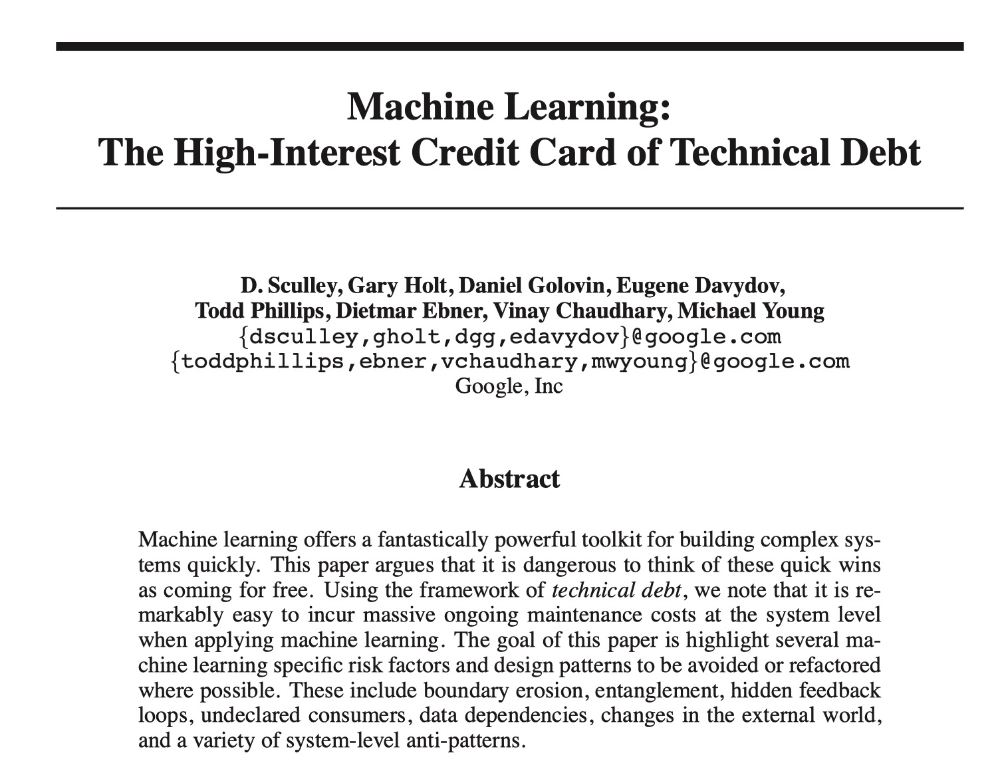
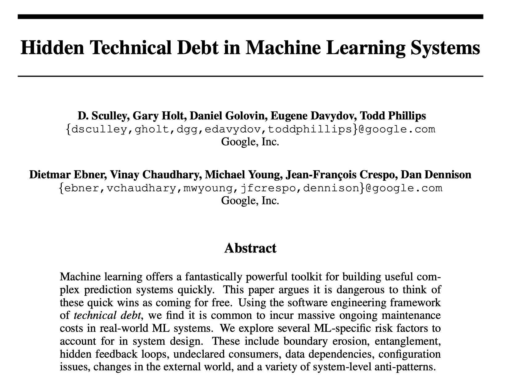

# 三、机器学习项目团队组成

[3.机器学习项目团队组成 <--](/ch03_ML-Teams.md) | [--> 4.产品经理的工作挑战](/ch04_Product-Manager's-Challenge.md)

## 为什么需要讨论这个问题

深度学习已成为下一波技术红利的基础，这一点已有很大的共识。深度学习领域创业团队随着时间的推移，已经逐步表现出对于现金流和利润的渴望，有强烈的参与政企领域市场项目的动力，但很有可能乐观的认为：只需要再配备“产品经理、前端开发、后端开发和销售”就可以软件产品参与政企市场的项目。

深度学习从一种“**Technical**”转化为“**System**”的过程中，在软件工程与技术层面存在的潜在问题，在 NIPS 2014 的《Machine Learning: The High Interest Credit Card of Technical Debt》中已经开始探讨：“Machine learning offers a fantastically powerful toolkit for building complex systems quickly. This paper argues that it is dangerous to think of these quick wins as coming for free. Using the framework of technical debt, we note that it is remarkably easy to incur massive ongoing maintenance costs at the system level when applying machine learning. The goal of this paper is highlight several machine learning specific risk factors and design patterns to be avoided or refactored where possible. These include boundary erosion, entanglement, hidden feedback loops, undeclared consumers, data dependencies, changes in the external world, and a variety of system-level anti-patterns.” -- （Reference：Machine Learning: The High Interest Credit Card of Technical Debt）

在 NIPS 2015 的《Hidden Technical Debt in Machine Learning Systems》对此问题进行了进一步讨论。

在上图中可以看到：“Only a small fraction of real-world ML systems is composed of the ML code, as shown by the small black box in the middle. The required surrounding infrastructure is vast and complex”。（-- Reference：Hidden Technical Debt in Machine Learning Systems）

除“Technical Debt”之外，考虑到政企领域项目的特点，对于行业的认知、业务解决方案的理解与设计，以及项目管理、交付能力等非技术的“软实力”的欠缺与“短板”可能更难以意识到。

所以，在机器学习团队的组建过程中，我们需要具有更加工程化的思考方式已尽可能的避免“技术债务”与“软实力欠缺”。

## 机器学习团队基本角色

考虑到本文主要探讨的是机器学习方法的任务，所以对于**Traditional Software Engineering**部分所涉及的不同角色，比如：架构师、UI、UEX、前端、后端、移动端及功能测试、自动化测试等，全部合并为“Software Develop Engineer（SDE）”进行指代。

基于上述前提，机器学习团队的角色划分基本如下图。

### 1. Product Manager

机器学习由一项“技术成果”转变为可落地应用的“产品”，并在可接受的阈值范围（精度、速度等）内稳定运行，产品经理是这个过程中最重要、也不可或缺的一个角色。

先，抛开机器学习领域相关的内容，来看看产品经理要做好一个产品的规划工作，最基本产品需求工作需要关注哪些内容：

- **需求挖掘**：如何发现“潜在”需求，很多时候“隐性需求”才是更有价值的。

- **需求判断**：如何识别“伪需求”，驱动需求产生的“本质”是什么。

- **需求分析**：需求背后的“动机”是什么，需求的“场景”是什么，需求的“因果链”是什么。

- **用户识别**：是否找准了“真实”用户，“典型用户”需求是否具有“普适”性。

- **价值分析**：需求实现对用户、产品的价值，产品实现后对企业对价值。

- **风险分析**：需求实现的代价、实现的周期、消退周期。

**洞察力**对于产品经理来说，是一个非常重要的能力，而如何去考察一个产品经理**洞察力**？似乎没有比较科学的“先验知识”，大多只能通过结果去做后验。

产品经理又该如何去提高**洞察力**呢？似乎是没有捷径的，只有对目标领域做深度认知，不断思考、深度思考，反复推演。

#### 1.1 主要工作内容

- 需求调研，需求分析，产品设计
- 产品解决方案定义
- 项目解决方案定义
- 产品开发过程管理

#### 1.2 主要工作产出物

- PRD
- 产品白皮书
- 项目解决方案
- 产品开发交付

有关产品经理的工作难度与挑战，在[第四章](/ch04_Product-Manager's-Challenge.md)进一步详细说明。

### 2. Project Manager

当我们完成产品开发（有可能产品还是半成品或者仅仅是 MVP）向政企客户成功销售后，那么项目就正式启动了。如前一章所述，项目经理需要完成：管理、协调、控制、交付等项目生命周期内的工作。事实上，在实际操作层面，大量存在这样的情况：“**_以项目养产品_**”，大致解释一下。

公司在某些技术领域，比如“人脸识别”、“车辆识别”、“语音转文字”、“目标检测”等技术方向取得了比较好的精度，基本达到或者超过了 State-of-the-art 水平，具有商业化落地应用的可能，也会有一些行业客户咨询相关技术的应用情况。而做为技术驱动的公司，是没有相关完备产品与行业解决方案的储备的，所以需要在政企客户市场走“捷径”。基本过程（套路）如下：

1 - 对照客户需求，在行业对标寻找现有竞争对手的产品与方案组成以及核心功能；  
2 - 解决方案团队与产品经理团队共同“定义”针对用户需求的，具备足够竞争力的解决方案思路；  
3 - 将上述解决方案思路，转化为高水准的 PPT；  
4 - 基于公司技术积累、现有产品，结合用户核心需求，快速完成 Demo 和 MVP 的开发；  
5 - 如一切顺利，拿下项目后，组建项目团队。在项目团队中会特别安排产品经理与解决方案团队成员组成“需求团队”；  
6 - 结合合同需求，用户需求调研获取的一手需求，行业竞争对手的产品功能，项目经理带领“需求团队”，完成既能满足项目交付，又足够具有行业通用性的“产品需求”（这是理想状态，在实际操作中各种痛苦，冷暖自知）；  
7 - 需求团队与架构团队共同讨论确定三件大事：产品基础/通用/支撑功能，产品特性功能，项目功能，基于这种认识开始架构层面设计与技术路线选择（强调一下，项目是有时间限制的，不能为了追求“理想”忽略了进度。）；  
8 - 研发团队快速完成在 master（Dev）分支完成第一部分基础和通用功能开发；然后分支出“pd-XX”进行项目所需的产品特性功能开发，测试合并入 master 后；分支出“pj-XX”进行项目功能的开发。在项目开发未完成前，产品分支的开发依然是服务于项目的，以便快速合并；  
9 - 事实上，单一客户的需求必然有一定片面性，在做开发同时，需求团队需要进一步研究行业需求，快速对产品部分的需求做出更新与完善；  
10 - 理想状态下，项目交付后，在我们的版本控制系统里就有一个完整的项目版本和一个基本成熟的产品版本，这样就实现了**以项目养产品**，同时最大限度的降低了研发周期与成本。

不要以为下周回国的贾老板是 PPT 造车高手，政企领域大玩家都是 PPT 做产品高手。看到没有，“先有鸡还是先有蛋”的问题，可以解决为“鸡和蛋”一起有。

产品经理和项目经理分别做为产品和项目的“总经理”，是实现技术到产品到落地交付的最核心的中坚力量。这两个岗位的职责一部分是清晰可区分的，一部分又是重叠和需要共同写作完成的。

我相信，在深度学习这个领域做政企市场落地的公司，大都存在这种**以项目养产品**的实际操作。所以，项目经理要求更需要具备产品经理的能力与“洞察力”，这也是为什么在本文中我会把项目经理的相关工作内容与产品经理合并在一起去写的重要理由之一。

#### 2.1 主要工作内容

- 项目解决方案
- 项目实施计划、项目交付（实施）方案
- 需求调研
- 项目管理
- 平衡好项目管理“铁三角”

#### 2.2 主要工作产出物

- 项目文档
- 项目交付

### 3. Business Consultant

业务咨询顾问更多的是一种“角色”概念，并非所有公司都会设置专职岗位。一般情况下，业务咨询顾问角色由两类人员担任。第一类是在目标行业领域具有丰富工作经验，做为业务专家参与业务咨询工作；第二类是社会新人，有志于成为业务咨询顾问，一般从熟悉模块功能、参与业务需求调研开始培养，视个人发展意愿，后期会向产品经理、项目经理或者销售方向转岗。

业务咨询顾问的工作主要由三部分构成：

- 配合产品经理/项目经理完成产品/项目的需求调研，并形成对应的需求文档；

- 配合销售经理完成项目的售前咨询与产品/方案介绍，并形成售前咨询方案/PPT；

- 行业/竞品分析，了解发展趋势与动态，给出产品方向性建议；

#### 3.1 主要工作内容

- 需求调研
- 解决方案
- 业务分析

#### 3.2 主要工作产出物

- 需求调研报告/PRD
- 相关文档

### 4. Software Develop Engineer

如前述，本文主要探讨的是机器学习方法的任务，所以对于**Traditional Software Engineering**部分所涉及的不同角色，比如：架构师、UI、UEX、前端、后端、移动端及功能测试、自动化测试等，全部合并为“Software Develop Engineer（SDE）”进行指代。

同样的图，再来看一遍。实际上，做为一个产品或者项目交付的系统来说，深度学习的 models 部分所占比重并不高，其余的工作内容更多的是偏向于传统软件工程的架构、工具、数据、代码等内容，而这部分内容是 SDE 团队更加擅长和熟悉的。

对于 SDE 部分的工作内容，不做过多介绍，大家都非常清楚分工、工作内容与交付物，对于涉及到深度学习的部分，有如下建议：

- APIs、MQ、JSON 等规约内容提前约定、设计；

- 对于 CV 类的项目有可能 Web 页面需要展示实时视频流与标注框，提前约定好：A：传坐标前端绘制；B：推理平台 OpenCV 绘制标注框，以及是否需要转码为视频流；还需评估抽帧后的前端展示效果，是否满足需求；

- 业务端对 DL 端的调用、任务等接口设计；

### 5. Data Scientist

数据科学家是进几年新兴的一个工作岗位，对于不同的公司、领域，对于“Data Scientist”这个角色的定义可能不尽相同，但做为一个跨学科的职位，总体来说具有以下工作内容：独立的数据处理能力，进行复杂的建模（机器学习）或模型训练（深度学习）从中发现数据的商业价值与意义，并拥有良好的书面、口头沟通、汇报能力，能对发掘价值进行总结与宣讲。

#### 5.1 主要工作内容

- 数据价值挖掘
- 参与、指导团队建模与模型训练工作
- 商业价值分析与汇报

#### 5.2 主要工作产出物

- 模型
- 分析报告与汇报

### 6. ML Researcher

研究员的主要任务更偏向于前瞻性的探索与研究，跟踪技术趋势，解决新场景下的建模问题，进行算法的精度与性能调优以及思考、推动算法的应用与落地。

#### 6.1 主要工作内容

- 模型训练、算法调优
- 前瞻性研究与跟踪技术趋势
- 算法落地应用可行性论证
- 推理系统架构与设计

#### 6.2 主要工作产出物

- 模型、Paper
- 分析/评估报告

### 7. ML Engineer

机器学习工程师一般在数据科学家和研究员的工作基础上，进一步进行模型的训练与调优，以匹配项目/产品设定的技术指标，并完成推理系统与模型的部署以及与业务软件系统的集成。对于机器学习工程师来说，具备一定的代码实现能力以及掌握一种主流的后端开发语言（Java、C#、.NET Core、Go 等）是有必要的。

#### 7.1 主要工作内容

- 模型训练、算法调优
- 推理系统部署与模型部署
- 推理系统接口开发
- 软件系统集成

#### 7.2 主要工作产出物

- 模型
- 推理系统
- 软件集成

### 8. Data Engineer

数据工程师的主要任务是完成 data management pipeline 工作。完成数据抽取、聚合、清洗、存储以及自动化流水线的监控工作，确保后续 ML 工作的数据可用性。

#### 8.1 主要工作内容

- 数据入库
- 系统监控

#### 8.2 主要工作产出物

- 数据库/数据仓库

### 9. DevOps Engineer

DevOps 的理念已经得到了广泛的认同与实践，相关工具链从开源免费到闭源商用、从私有化部署到 SaaS 服务，极为丰富与完善，当选项太多后，如何选择与应用成了一个新问题。DevOps 其中涉及的知识点与技能栈的要求相对较高，所以 DevOps Engineer 这样一个岗位/角色的出现也是合理的。

#### 9.1 主要工作内容

- 在组织中建立合适的 DevOps 流程，并分析、优化 DevOps 实践
- 选择适当的工具实现过程自动化
- 建立持续的 CI/CD 环境加速软件开发和部署过程，规避风险
- DevOps pipeline 工具链的选型、部署、维护与监控

#### 9.2 主要工作产出物

- DevOps 基础设施
- DevOps 文化引导
- 用户私有化环境的产品部署

### 10. Delivery Engineer

如之前所述，在传统的软件交付领域有**三分软件，七分实施**这种“共识”，交付环节对于软件项目来说，是非常、非常、非常重要的，千万不可轻视。这项工作，绝非**安排一个项目经理，带上几个刚毕业愿意出差、能吃苦的小孩**就可以顺利完成的，再考虑到深度学习部分带来的项目技术概念复杂性、结果不可预测性、不可解释性，会使得项目交付工作更加艰难，更需要有专业化的团队去完成交付工作。

机器学习项目的落地交付环节，是在项目经理的带领下，由一批具有各种不同技能与能力的交付工程师组成团队，完成项目交付与实施工作。有关项目交付的更详细的说明，在[第十一章](/ch11_Project-Delivery.md)。在这里先简单说明一下交付团队集体所需要具备的专业知识与技能组合：

- 沟通、协调与项目管理能力与情商
- 行业理解、流程认知与行业专属名词熟知程度
- 需求沟通与需求判断能力
- 公文写作与汇报能力
- 系统架构评估与代码实现评估能力
- 主机、网络、存储等系统集成工程与技术能力
- 综合布线、施工管理及与工人沟通能力（CV 项目）
- 问题定位与排查能力
- 变通能力与处事灵活性
- 开会能力、风险管理能力
- 抗压能力与心里素质

#### 10.1 主要工作内容

- 制订项目交付计划、策略
- 项目需求调研
- 系统部署与现场测试
- 培训用户使用
- 上线后监控

#### 10.2 主要工作产出物

- 项目计划、实施方案
- 项目过程文档
- 项目需求调研报告
- 项目交付、验收
